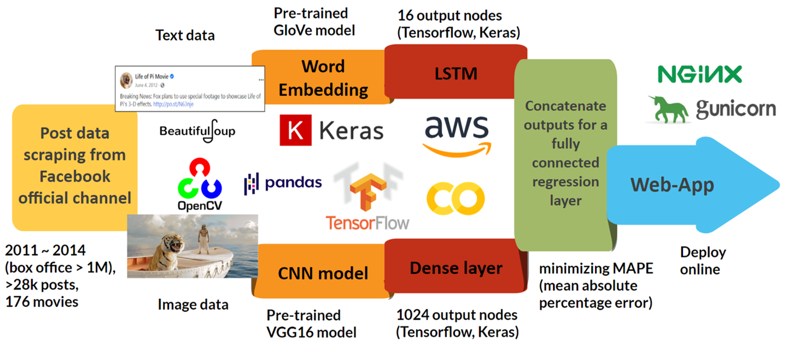

# Post2Success - Spark your social media posts!

Post2Success is a marketing tool to help you find the right post the people like, it is specially designed for movie production companies to succeed their promotional campaign to social media platform. It can perform multi-task includes:

### Post analysis
Detailed analysis of the port with feature extaction, deep insight of every aspect of your post.

### Popularity prediction
Confident prediction of the number of likes, number of comments and number of shares that your post is expected to attract on social. media platform.

### Improvement suggestion
Feed back from AI of possible improvement for your post to attract more attention.

## Model pipeline

## Data scraping
A common social media post is consist of an image and some text, those two types of data are scraped separately.

### Post info&Text scraping
In `script` folder run `python post_scraper.py`. Post information will be saved in `data/posts` folder as a binary pickle file.

### Image scraping
In `script` folder run `python photo_scraper.py`.  Images will be saved in `data/photos` folder in the form of `filename_postid`.

## Model training
Two models are available including a linear regression model as baseline. To train the linear regression model, run `python linear_model_train.py`. Three models for the prediction of *number of likes*, *number of comments* and *number of shares* will be stored in `models` folder as binary pickle files.

To train the multi-input deep learning model, run `python deep_learning_model_train.py` (needs large memory and takes time). Three models for the prediction of *number of likes*, *number of comments* and *number of shares* will be stored in `models` folder as binary pickle files.

## Web application
The web application is available at [post2success](http://www.dataprocessor.online/). The source code are available in `web-app` folder.